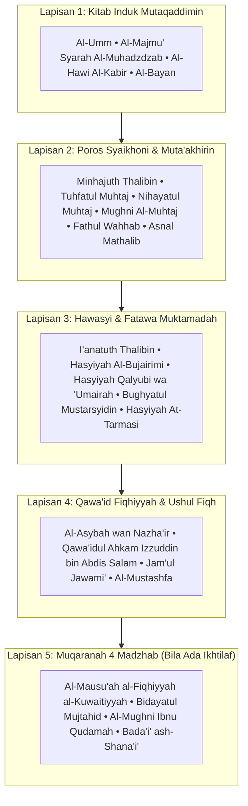

# 🏛️ Dokumentasi Perencanaan & Arsitektur Metodologi `/bahtsu`
### Standar Resmi Munas Alim Ulama, Konbes Nahdlatul Ulama, & LBM PBNU

Dokumen ini mencatat rekam jejak perencanaan (*planning*), evolusi arsitektur, dan komparasi metodologis dalam perumusan keputusan hukum Islam pada skill **`/bahtsu`**.

---

## 1. Komparasi: Format Awal (Ringkas) vs Standar Munas-Konbes NU

Sebelumnya, rumusan masalah dijawab dengan pola fatwa ringkas (ala tanya-jawab biasa). Setelah mengkaji dokumen resmi **Munas Alim Ulama Lampung 1992**, **Muktamar NU ke-33 Jombang 2015**, dan **Munas NTB 2017**, terjadi transformasi mendasar:

| Aspek | Format Awal (Ringkas) | Standar Munas-Konbes NU & LBM-NU (Sekarang) |
| :--- | :--- | :--- |
| **Kuantitas Referensi** | 1 – 2 rujukan saja per kasus. | **Multi-Referensi Wajib (Minimal 3 hingga 7+ ibarat)** per sub-masalah (*Zero Single-Source Policy*). |
| **Keragaman Lapisan Kitab** | Hanya mengutip satu kitab fiqih praktis (misal *I'anah* saja). | **5 Lapisan Kitab Berantai:** 1) Mutaqaddimin (*Al-Majmu', Al-Hawi*), 2) Syaikhoni & Muta'akhirin (*Tuhfah, Nihayah, Mughni*), 3) Hawasyi (*I'anah, Bujairimi, Qalyubi*), 4) Qawa'id Fiqhiyyah & Ushul (*Al-Asybah, Qawa'idul Ahkam*), 5) Muqaranah 4 Madzhab. |
| **Hierarki Istinbath** | Langsung mencocokkan teks ke fatwa. | **4 Tingkat Pengambilan Keputusan (Munas Lampung 1992):** 1) Qauli, 2) Taqrir Jama'i, 3) Ilhaq al-Masa'il bi Nazha'iriha, 4) Manhaji (Istinbath Jama'i). |
| **Instrumen Manhaji** | Tidak terakomodasi secara terstruktur. | **Tri-Metode Muktamar 33 Jombang 2015:** 1) Metode Bayani (kebahasaan), 2) Metode Qiyasi (analogi ushuli & tahqiqul manath), 3) Metode Istishlahi/Maqashidi (*Kulliyatul Khams*). |
| **Klasifikasi Sidang** | Semua masalah dianggap seragam. | **Tri-Matra Masail:** 1) *Masā'il Wāqi'iyyah* (kasuistik aktual), 2) *Masā'il Maudlū'iyyah* (tematik konseptual/kebangsaan), 3) *Masā'il Qānūniyyah* (telaah yuridis undang-undang negara). |
| **Korelasi Hukum (*Wajhul Istidlal*)** | Hanya menampilkan teks Arab dan terjemahan biasa. | **Wajib menyertakan *Wajhul Istidlal / Wajhul Ilhāq*:** Analisis argumentatif mengapa nash klasik tersebut relevan dan menjadi 'illat bagi kasus kontemporer. |
| **Penyikapan Ikhtilaf** | Langsung menyimpulkan satu fatwa. | **Taqrīr Jamā'i & Al-Jam'u wat Taufiq:** Mengkompromikan pendapat (*i'mālul kalāmayn awlā min ihmālihimā*), membedakan qaul mu'tamad vs muqabil mu'tamad, serta syarat *intiqal al-madzhab* tanpa talfiq bathil. |
| **Format Penyorotan Teks** | Bold standar atau italic. | **Multi-App Highlight Protocol:** Format `<u>**【 ... 】**</u>` yang tahan uji dan tampil mencolok di **Capacities** maupun **Microsoft Word**. |
| **Atribusi & Akuntabilitas** | Anonim / Tim fiktif tanpa identitas sistem. | **Transparansi AI Model Agent Dinamis:** Wajib mencantumkan entitas model AI yang aktif secara kondisional (misal: *Gemini 3.8 Flash High*, *Claude 3.7 Sonnet*, dll.) dan kapasitas tim asistensi telaah agar hasil kajian dapat diaudit dan dipertanggungjawabkan (*al-amānah al-'ilmiyyah*). |

---

## 2. Peta 5 Lapisan Referensi Berantai (*Al-Marāji' al-Mutawasithah*)

Dalam setiap perumusan Bahtsul Masail, dalil dan ibarat disusun berjenjang untuk membangun argumentasi hukum yang kokoh:



---

## 3. Alur Kerja Penelusuran Online (Turath.io REST API v3)

Untuk menjamin ketersediaan referensi tanpa membebani penyimpanan perangkat, skill ini menggunakan mesin pencari `scripts/turath_search.js` yang terhubung langsung ke **Turath.io**:

1. **Dekomposisi Istilah:** Mengurai kasus waqi'iyyah ke dalam 3-5 variasi frasa kunci Arab (*takhrij al-alfazh*).
2. **Eksekusi Multi-Kueri Paralel:**
   ```bash
   node scripts/turath_search.js -m "من مات وعليه صلاة,فدية الصلاة,الاستئجار على الصلاة" -l 3
   ```
3. **Penyaringan & Verifikasi Teks:** Memastikan kutipan teks utuh, berharakat pada poin krusial, dan menyertakan URL aktif untuk verifikasi musyawirin di peramban.

---

## 4. Struktur Output Dokumen Keputusan

Format naskah keputusan mengikuti tata urutan dokumen Munas Alim Ulama NU:
1. **Header Metadata & Akuntabilitas:** Tema, Klasifikasi, Fan Fiqih, **Penyusun Naskah** (Entitas AI Model Agent yang aktif secara kondisional), dan Waktu Hijriyah/Masehi.
2. **I. Deskripsi Masalah & Kerangka Konseptual** (*Tashawwur Mas'alah*)
3. **II. Pokok Masalah (*As'ilah*)**
4. **III. Rumusan Keputusan Hukum (*Al-Qarār*)**
5. **IV. Dhawābith & Rekomendasi Solutif (*Makhārij Fiqhiyyah*)**
6. **V. Dasar Pengambilan Hukum (*Al-Marāji' wal Ibarāt*)**
   - Dilengkapi *Wajhul Istidlal / Wajhul Ilhāq* pada tiap-tiap ibarat.
   - Dilengkapi nomor jilid/halaman dan tautan verifikasi Turath.io.
   - Kalimat kunci (*mahallus syahid*) disorot dengan format `<u>**【 ... 】**</u>`.
